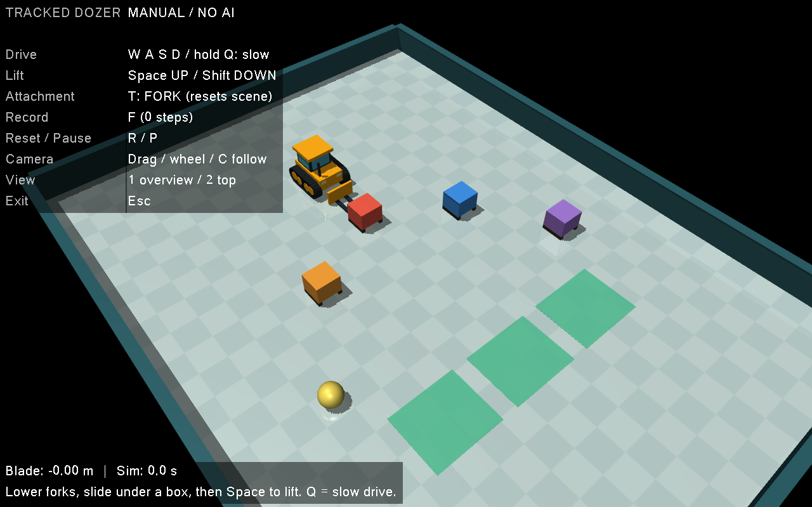

# Physical AI Course Builder

人の実演から遊びのギミックを理解・命名・蓄積し、ロボットで新しいコースをつくることを目指すプロジェクトです。

**現在は手動操作・配置設計・限定した2箱の門や坂の施工と走行ができます。このチャットのAIによる計画・命名・結果評価も接続しました。模倣学習の収集・学習・評価コードは準備済みですが、人のお手本による学習は未実施です。自由なコース全体の施工とアプリからAIへの自動問い合わせは未実装です。** AI使用必須の最終課題に向けた開発途中のコードであり、完成提出版ではありません。



## できること

### 位置と向きを合わせる、お手本収集モード

`pose-practice.cmd` を起動し、1=後退、2=前進、3=左斜め後ろを選びます。車体の中心を緑の丸へ、車体前方を緑の矢印へ合わせます。WASDで移動、Qを押しながらで低速、2で真上の視点。空荷の練習なのでフォーク昇降と装備変更は無効です。

1. **R**で最初の位置へ戻す。
2. **F**を押して画面下が **RECORDING** になったことを確認。
3. 目標から8cm以内、向きの差8度以内に合わせて1秒停止すると **SUCCESS - SAVED** になり、自動保存します。速度・回転速度も停止判定に含めます。
4. 次のお手本はR→F。途中終了はF、やり直しはR。途中の記録は失敗・未完了として残り、元のお手本を削除しません。

Fを押さずに練習した場合は **PRACTICE - NOT RECORDING**、成功しても **SUCCESS - NOT RECORDED** と表示します。120秒で試行終了。Pで一時停止、Escで終了。低速旋回には接地摩擦に負けない最小入力を残します。

記録は `recordings/pose/` の別ファイル。各50Hzの操作前後の状態に加え、目標、車体から見た目標位置・向き、速度、実際に使ったシーン、成功判定を保存します。画像や動画の録画ではありません。学習はまだ開始しません。

収集したら `check-demos.cmd` を開くと、練習ごとの成功候補の本数・あと何本必要か・重複・要点検ファイルを日本語で確認できます。最初の目安は前進と後退を各2本。左斜め後ろは後からでも構いません。これは記録内容の点検で、学習データへ変換する際には下記の物理再生も検査します。その段階で候補が減る場合があります。記録を書き換えたり、学習を自動開始したりはしません。

```powershell
.\.venv\Scripts\python.exe pose_dataset.py
.\.venv\Scripts\python.exe verify_pose_task.py
.\.venv\Scripts\python.exe verify_pose_ui.py
```

点検ツールは記録を書き換えず、未完了・偽の成功ラベル・不連続な状態・目標との不整合を検出します。成功した人の実演かつtrainケースだけを学習候補にします。評価用の右斜め後ろ・初期90度のケースは `--pose-practice rear-right-eval` / `rotated-eval` で起動でき、学習候補から除外します。今後は実演単位で訓練・検証も分ける予定です。この小さなケース分割だけで一般化性能を保証するものではありません。

物理試験ではスクリプト操作の後退で位置誤差約2.4cm・向き誤差0度まで到達し、停止成功を確認。位置が合っても90度違う向きは未達成、1秒未満の停止も未達成。テスト用記録は `.test-results/` に分離し、人のお手本として扱いません。

### お手本を物理シミュレーションで見返す

`replay-demo.cmd` で最新のお手本を再生します。特定のJSONLファイルをこの起動ファイルへドラッグして選ぶこともできます。Pで一時停止、Escで終了。記録がない場合や未完了の場合は、その理由を表示します。

保存した操作を物理エンジンに再入力し、記録された位置・速度との一致を毎ステップ検査します。状態の復元は開始時の1回だけで、再生中に座標をなぞって書き換えません。再生に成功したことと、元のお手本が目標を達成したことは別々に表示・記録します。再生は新しいAI推論や学習ではありません。

新しい記録は、走行途中の記録開始にも対応する完全な初期状態を保存します。同一のMuJoCoバージョンを要求します。旧記録は位置・速度から復元を試みますが、内部状態が不足して再現できない場合があります。元データは変更しません。

```powershell
.\.venv\Scripts\python.exe pose_replay.py recordings/pose/対象ファイル.jsonl --report .test-results/replay-01.json
.\.venv\Scripts\python.exe verify_pose_replay.py
```

スクリプトで作った移動中開始の225フレームで位置・速度の差が0、操作を改変した試験では不一致停止を確認しました。人のお手本による検証は収集後です。

### お手本から学習・評価する準備

まずは前進・後退の成功実演を各2本以上収集し、記録点検後に小規模な学習を試せます。左斜め後ろは次の段階でも構いません。本数は分割の最低条件で、性能を保証する数ではありません。現在、人のお手本での学習は未実施です。

```powershell
.\.venv\Scripts\python.exe pose_prepare.py --output .test-results/pose-dataset-01.npz
.\.venv\Scripts\python.exe pose_bc.py .test-results/pose-dataset-01.npz --output .test-results/pose-model-01.npz
.\.venv\Scripts\python.exe pose_evaluate.py --model .test-results/pose-model-01.npz --output .test-results/pose-evaluation-01.json
```

収集したケースごとに成功実演を最低2本必要とし、実演まるごとで訓練用・検証用に分けます。重複ファイル、失敗・未完了、テスト生成記録、評価用ケースは訓練候補から除外。さらに保存操作を物理再生し、記録との不一致がある実演も除外します。出力済みファイルは上書きせず、次回は末尾の番号などを変えます。標準化の平均・分散は訓練用だけから計算します。

モデルは7入力→32中間ユニット→前後進5択と旋回5択の小さなニューラルネットです。人の操作の分類を学ぶ行動クローニングで、CPUと既存のNumPyだけを使います。検証用の操作再現度を見て学習を打ち切り、最良の重みを保存します。操作の一致率が高くても、実際に連続走行できるとは限らないため、その後に物理評価を行います。

`pose_evaluate.py` は前進のみのルール・前後進ルール・指定した学習モデルを、同じ初期シーンと8cm/8度/1秒停止の基準で比較します。学習モデルなしでも `--output` だけでルールの基準値を作れます。位置だけを評価した以前の34.84秒→3.72秒の試験とは基準が異なります。

位置と向きの両方を評価したルールの初回結果は `examples/pose-baselines.json`。前進のみは5条件中1条件、前後進は3条件で成功し、斜め後ろは両方式とも120秒で未達成でした。前後進ルールの真後ろは5.66秒、位置誤差約3.9cm。これはこの簡単なルールの結果で、前進のみの手法全体の限界を示すものではありません。初期90度のケースは座標変換の整合性も見る条件であり、車体基準の入力として完全に未知とは限りません。

`python verify_pose_learning.py` で実演単位の分割、重複除外、混入拒否、勾配計算、モデル保存・再読込、物理評価への接続を検査します。検査は使い捨ての模擬記録と数値データだけで行い、人のロボット操作を学習した成果とは扱いません。モデル・生データはGitから除外しています。

学習後のモデルの動きは `pose_view.py` で表示できます。同じケースでルールの動きも表示可能です。Pで一時停止、Escで終了し、成功・失敗時は結果の状態で止まります。表示中に重みの更新はしません。モデルの学習元を画面に表示し、記録再生・ルール・ローカルモデル推論を区別します。

```powershell
.\.venv\Scripts\python.exe pose_view.py --rules reverse --case back
.\.venv\Scripts\python.exe pose_view.py --model .test-results/pose-model-01.npz --case rear-right-eval
.\.venv\Scripts\python.exe verify_pose_view.py
```

人のお手本のモデルはまだありません。表示用制御と描画なし評価の一致は、前後進ルールの3条件および停止しか出力しない未学習テストモデルで確認しています。この試験を学習成功とは扱いません。

### 前進・後退の位置目標だけの比較

`reverse-demo.cmd` は、真後ろ1mの緑の目標にバックで近づいて停止します。`forward-only-demo.cmd` は同じ条件を従来の前進だけで走ります。どちらもPで一時停止、Escで終了。`python app.py --maneuver reverse-enabled` / `--maneuver forward-only` でも起動できます。

`python verify_maneuver.py` で前方・真後ろ・左右斜め後ろ・初期向き90度の5条件を両方式で比較します。今回の真後ろ1mは34.84秒→3.72秒、左右斜め後ろは31.58秒→5.50秒、前方は両方3.82秒でした（シミュレーション時間）。結果は `examples/maneuver-result.json`、再実行結果は `.test-results/maneuver-report.json`。

目標への旋回が約101度を超えると後退を選び、その目標に着くまで前後進を固定する簡単なルールです。切替のちらつきを避けます。AIモデル・API・学習は使用しません。今後の模倣学習や、検討中のJevと比べる基準です。Jevは未接続・課金なし。

現在は空荷の位置目標だけで、最終姿勢は指定しません。停止誤差は約13〜14cmで、爪差し込みの精密位置合わせにはまだ足りません。障害物を予測して回避する機能はなく、後方に箱がある試験では接触を検出して失敗停止します。坂施工などの既存デモは従来制御を維持し、この後退選択は独立した比較モードだけで有効です。

### チャットのAIが計画した「こもれびの小さな峠」

`ai-slope-course.cmd` で、保存したAI計画を読み、坂2個を運んで設置し、そのコースを走ります。日本語の名前はウィンドウタイトルに表示。AIが制約を読んで選んだ配置X=1mを、実際の運搬目標と走行経路へ渡します。

計画→検査→物理施工・走行→結果JSON→チャットAIによる評価、を一巡させました。名前・理由・配置は `examples/ortiz-slope-plan.json`、結果は `examples/ortiz-slope-result.json`、AIが結果を読んだ判断は `examples/ortiz-slope-review.json` に保存しています。初案は166.36秒で成功し、比較3位置の中で最短だったため採用を維持しました。最適解や一般的な成功率を示すものではありません。

```powershell
.\.venv\Scripts\python.exe slope_plan.py --capabilities
.\.venv\Scripts\python.exe slope_plan.py examples/ortiz-slope-plan.json --report .test-results/slope-result.json
.\.venv\Scripts\python.exe app.py --slope-plan examples/ortiz-slope-plan.json
.\.venv\Scripts\python.exe verify_slope_plan.py
```

対応はX=1/1.5/2mの3位置、上りY=-1m・下りY=1.05m、向き0度、上り→下りの施工、Y正方向への走行です。現在はAIもこの限定テンプレートから選びます。下位コードが接近・差し込み・後退などの具体的操作を決めます。任意の形や順番を実行する仕組みではありません。

3位置で物理施工・走行成功（166.36/203.00/200.22秒）。不正な位置、重なり、逆順、回転、重複、非数など11種類は物理実行前に拒否し、理由を結果JSONへ返します。これは対応テンプレートの検査で、汎用の衝突回避計画ではありません。

**AIによる計画と評価はこのチャットで行います。アプリからAIへの自動問い合わせはなく、再生中は新しい推論や学習を行いません。** 計画を変更したら再実行し、結果JSONをこのチャットへ渡して評価・修正します。モデルの学習は今後の工程です。

### 上り坂・下り坂を運んで組み、渡る

`build-slopes.cmd`（または `python app.py --build-slopes`）で、上り坂を設置→空荷で旋回・後退→下り坂を設置→完成した坂を渡るデモを起動します。Pで一時停止、Escで終了。

固定した初期配置と目標で203秒（シミュレーション時間）。各パーツを約20.8cm持ち上げて約2.98m運び、設置誤差は約1.3〜1.6cm。4面への車輪接触と車体上昇約44cmを確認しました。途中の座標変更・リセット・吸着固定はありません。接続には施工誤差を吸収する公称5cmの隙間を設けています。2倍速なら約1分42秒ですが、提出用動画は未収録です。

持ち上げ前に車体の向きを合わせ、持ち上げ後に不要な横補正をしない制御を追加しました。旋回による横ずれの補償値はこの配置で調整した仮値です。任意配置・積載中の旋回・実機への一般化は未検証。設計室の自由配置や上位AI計画との接続も今後です。下位制御はルールで、学習や実行中の新しいAI推論は行いません。

`python verify_slope_assembly.py` で連続施工・走行と、設置済み部品に外力を加えた際の停止を検査します。部品の質量各1.5kg、寸法、剛体形状は試作の仮設定です。

実務への設計メモ：ロボット側の能力に加え、持ち上げやすい備品、共通寸法、把持位置、置き場の向きや作業通路を整えることも検討します。

### 手動操作と記録

- WASDで車両を運転し、ブレードで箱を押す。
- フォークを箱の脚の間に差し込み、持ち上げ・運搬・床への設置を行う。
- 装備をブレード／フォークで切り替える。
- 状態・操作・次の状態を50Hzで記録し、模倣学習用のデータ収集を準備する。
- 左右別々に回転する履帯のアニメーションを表示する。

## 起動（Windows）

検証環境はWindows、Python 3.12、MuJoCo 3.3.7です。OpenGL対応のグラフィックス環境が必要です。

1. このリポジトリをcloneするか、ZIPを展開します。
2. Python 3.12を用意し、`setup.cmd` を実行します。初回は依存パッケージの取得に通信します。
3. `start.cmd` を実行し、表示された3D画面をクリックします。

日本語入力が操作に干渉する場合は英数入力へ切り替えてください。通常の操作時にAPIや外部通信は使いません。
セットアップはフォルダ内の `.venv` へインストールします。

手動セットアップ：

```powershell
python -m venv .venv
.\.venv\Scripts\python.exe -m pip install -r requirements-lock.txt
.\.venv\Scripts\python.exe app.py
```

`requirements-lock.txt` は動作確認した全依存のバージョン、`requirements.txt` は直接依存の指定です。
Windows以外での起動は未検証です。

## 操作

### 坂道も運んでコースをつくる

`move-ramp.cmd`（または `python app.py --portable-ramp`）で、坂道の下へフォークを差し込み、持ち上げ→約3m運搬→設置→回り込み→その坂を走行、を約93秒で実行します。Pで一時停止、Escで終了できます。

坂の天面は既存ブロック4個と共通の44cmです。片側の上り長さ1.5mを維持し、傾斜は約16.3度（以前の30cm版は約11.3度）になりました。今後のパーツもこの天面高を基準にします。高さの一致を検証済みですが、坂から箱への乗り移りや連結機構はまだ検証していません。

坂道は床に固定していない自由物体です。途中で座標を書き換えたり、フォークへ固定したりしません。長さ3.6m・幅1m・高さ44cm・質量3kg、中央の下に8cmの差し込み空間がある試作モデルです。寸法と質量は仮の値で、施設の実測値・製品仕様・実機の運搬能力を示すものではありません。

`python verify_portable_ramp.py` で持ち上げ約20.6cm、運搬約2.98m、設置誤差約1.4cm、車体上昇約44cm、3面への車輪接触を検査できます。実行中のリセットや直接的な姿勢変更がなく、最後に坂と車両が静止することも確認します。下位制御はルール制御です。この独立デモの経路・施工位置は固定で、実行時AI推論は行いません。

設計室にも同じ形の坂道を追加しました。「坂道コースの例を置く」または「坂道を追加」から配置し、ドラッグ・矢印キーで移動、標準44cm（旧規格20/30/40cmも保持）を選択、保存・3Dプレビューできます。ひとつ戻す・坂道を外す操作にも対応。

**「この位置へ坂を運んで渡る」から、編集したX位置への施工を実行できます。** 対応は坂X=0.5〜2m、Y=0、天面44cm、箱2個はX=4・Y=±3の待機位置、単体坂なし。「坂道コースの例を置く」で準備できます。箱は最初から待機位置に置き、今回運ぶのは一体型の坂だけです。資材はX=-1.5、車両はX=-3から開始。自由な障害物配置や積載中の旋回には未対応で、条件外は実行前に拒否します。

`python verify_ramp_build.py` でX=0.5・1.25・2mを検証。設置誤差約1.4〜1.5cm、施工と走行67.56〜98.52秒。CLIは `python app.py --portable-ramp --layout designs/latest.json`。描画上の初期配置と運搬成果を区別します。

保存データと3D形状、保存・再読込・起動要求の処理、編集操作の状態変化は検査済み。今回の環境は通信制限があるためHTTP経由の再試験は実行できず、保存処理を通信なしで検査しました。更新したブラウザ画面の実操作は未確認です。設計室の起動用ウィンドウを閉じて `design.cmd` を起動し直すと更新版を利用できます。

### 上り坂・下り坂を単体で置く

「上り坂を追加」「下り坂を追加」で、それぞれ1個ずつ配置できます。長さ2m・幅1m・天面44cm、斜面1.5m＋平らな接続面0.5mです。ドラッグ・矢印移動、90度回転、削除、ひとつ戻す、保存・3D表示に対応。「上り＋下りをつなぐ例」で2個の接続例を置けます。向き0度のとき、＋Y方向へ進むと上り／下りになります。

各パーツは自由物体で床に固定していません。`python verify_slope_parts.py` では2個を接続した初期配置で車両が登降し、4面への車輪接触・約44cmの上昇、パーツ移動最大約0.05cmを確認。これは据え付け済みの走行試験であり、施工成果ではありません。独立パーツの単体運搬は下記の実験から実行できます。設計室の任意配置への施工、2個を順に運んでつなぐ制御はまだ未完成です。任意の接続・向きでの走破性は未検証で、各1.5kgは仮の試作値です。

### 上り・下りをそれぞれ運ぶ

`move-up-slope.cmd`／`move-down-slope.cmd`、または `python app.py --move-slope up`／`down` で単体坂を運びます。中央の目標X=1.5mへ約3m運び、約16.3秒で下ろして爪を抜きます。Pで一時停止、Escで終了。

坂の天面形状は維持し、下側を開けて持ち上げ用の桟を付けました。偏った重心に合わせ、車両の進路をパーツ中心から左右25cmずらして爪を入れます。質量各1.5kgは仮の剛体モデルで、実物の構造強度・重量・変形は再現していません。床や爪への固定、施工中の座標変更は行いません。

`python verify_slope_transport.py` で上り／下り×目標X=0.5・1.5・2.5mの6条件を検証。持ち上げ約20.8cm、運搬約1.98〜3.98m、設置誤差約1.4cm、約14.4〜18.1秒でした。爪と桟の接触、床への復帰・静止・天面44cmを確認し、拾えなかった場合も失敗として停止します。旧箱運搬4条件、形状変更後の単体坂2個の接続走行も再検証済み。

2個を連続して施工する試験は、空荷旋回後の横ずれによって2個目の運搬が不安定で未完成です。単体運搬の成功と区別しています。学習ではなく位置・姿勢に基づくルール制御です。

### 以前の固定坂を登って降りる実験

`ramp-demo.cmd`（または `python app.py --ramp`）で、高さ35cm・幅1.8m、上り2m→水平1m→下り2mの坂を走ります。フォークを上げてから発進し、約19秒で通過・停止します。Pで一時停止、Escで終了できます。

これは**据え付け済みの坂を走る独立した物理実験**です。坂の施工、配置エディターへの追加、AIによる坂の選択はまだ接続していません。寸法は実験用の仮値で、施設の実測値ではありません。

`python verify_terrain.py` で高さ25・35・45cm（傾斜約7.1・9.9・12.7度）の接触走行を検証できます。車体の上昇、上り・水平・下りそれぞれへの車輪接触、終点停止、床への復帰を確認します。衝突判定を外した「見た目だけの坂」では成功判定されないことも検査します。座標の直接変更・途中のリセットは行いません。下位制御はルール制御で、学習は行っていません。

### 完成形をドラッグして設計する

セットアップ後、`design.cmd` を開くとローカルのブラウザに「遊びの設計室」が表示されます。
赤・青の箱をドラッグ（または選択して矢印キー）で動かし、「この配置を保存」を押してください。
箱2個、一体型の運搬用坂1個、上り坂・下り坂各1個を配置できます。25cmグリッドで、単体坂のみ90度ずつ回転できます。重なりと範囲外の位置は保存時にも検査します。
「ひとつ戻す」で操作を取り消せます。

`editor.html` を直接開くと保存先が起動しません。必ず起動用のCMDから開き、起動したコンソールは残してください。
2026-10-08：ユーザーのPCで配置変更・保存・3D表示を確認。自動テストでも保存と再読み込み、無効な配置の拒否、3D上の座標を確認済みです。

「保存して3Dで見る」はMuJoCoの別ウィンドウで完成形を表示します。
**これは箱を指定位置に置いた静止プレビューです。ロボットが運んだ施工結果ではありません。**
プレビューでは運転・記録を無効にしています。カメラ操作、1/2の視点切替、Escによる終了が可能です。
前のプレビューを閉じてから新しい配置を開いてください。

保存先は `designs/layout_日時.json`、再開用の最新配置は `designs/latest.json` です。
個々の設計データはGitの対象外です。ローカルサーバーは127.0.0.1だけで待ち受け、外部APIを使いません。
「赤い箱を自動で運ぶ」で、赤い箱1個の直線運搬を実行できます。車両と箱を目標と同じY座標に並べた初期配置で開始し、フォーク挿入・持ち上げ・直進・下降・爪抜きを行います。
初期配置では箱のXを-1.5m、車両のXを-3mに設定します。実行中の箱や車両の座標は直接変更せず、アクチュエータで駆動します。これは状態を観測するルール制御で、学習済みAIではありません。
青い箱はこの単独運搬実験には出しません。共通の資材置き場からの搬入や積載中の旋回は未実装です。限定した2個の連続施工は下記の「箱2個を施工してから走る」で実行できます。
Pで一時停止・再開、Escで終了できます。前の3Dウィンドウを閉じてから実行してください。
成功は目標誤差6cm未満、箱が床で静止、フォークが離れたこと、持ち上げ運搬したことを確認して表示します。脱落・横ずれ・時間超過時は停止し、成功とは表示しません。

`python verify_transport.py` で4種類の目標位置を検証できます。検証例では約21cm持ち上げて0.49〜5.49m運搬し、設置誤差は約1.5cmでした。初期位置や障害物を自由に変えた際の成功率ではありません。

配置の検証は `python verify_layout.py`、手動での3D表示は `python app.py --layout designs/latest.json` で行えます。

### 手動運転

| キー | 操作 |
| --- | --- |
| W / S | 前進 / 後退 |
| A / D | 車体基準の左旋回 / 右旋回 |
| Space / Shift | フォーク・ブレードを上げる / 下げる |
| Q＋移動キー | 速度30%で位置合わせ |
| T | 装備交換。場面をリセットし、記録中なら保存終了 |
| F | 記録開始 / 保存終了 |
| R | 場面をリセット。記録中なら保存終了 |
| P | 一時停止 / 再開 |
| C | 追従カメラ切替 |
| 1 / 2 | 全体の斜め視点 / 真上 |
| 左 / 右ドラッグ | カメラ回転 / 移動 |
| ホイール | 拡大・縮小 |
| Esc | 終了。記録中なら保存 |

最初は正面の赤い箱で試してください。Shiftで爪を下げ、Q＋Wで箱の脚の間に差し込み、Wを離してSpaceで上げます。
ゆっくり運び、Shiftで床に下ろしてからSで爪を抜きます。急な旋回や浅い差し込みでは落ちることがあります。
キーを離すと駆動の目標速度がゼロになりますが、慣性により停止まで時間がかかります。他のウィンドウへ切り替えると入力を解除します。
緑の領域は目印であり、自動の成功判定はまだありません。

## 物理モデルの範囲

MuJoCoが接触・重力・摩擦を計算し、車輪を速度アクチュエータで駆動します。箱を移動させる際に座標を直接書き換えたり、フォークに吸着・固定したりはしません。

**履帯は外観・回転のアニメーションです。接地と走行は四輪で近似しています。** 履帯の連結、張力、たわみ、面接触、段差走破性を忠実に再現したモデルではありません。
昇降は鉛直スライド関節です。実物の油圧やリンク機構、土砂の掘削は再現していません。フォーク用の箱は約8cmの脚付きです。

## 記録

`recordings/demo_日時.jsonl` に保存します。収録データはGitの追跡対象から除外しています。

- ヘッダー：形式、MuJoCoバージョン、周期、使用シーンのSHA-256、装備、走行モデル、初期状態。
- 各ステップ：操作前状態、正規化された操作、アクチュエータ指令、操作後状態。
- 状態：時刻、位置・関節姿勢、速度、昇降目標、主要物体の位置・姿勢。
- 終了行：ステップ数と終了理由。

成功ラベル、画像、動画は未収録です。LeRobot形式への変換器も未実装です。終了行がない記録は未完了として扱ってください。

## 検証

```powershell
.\.venv\Scripts\python.exe verify.py
.\.venv\Scripts\python.exe app.py --screenshot check.png
```

`verify.py` は描画なしで前後進、左右旋回、昇降、押し移動、停止、記録、フォークによる持ち上げ・運搬・床への解放を確認します。検査用の記録は `.test-results/` に保存します。

指定された初期配置で確認した値：箱の上昇約0.454m、持ち上げての運搬約0.526m。これらは全配置での成功率を表すものではありません。

## ファイル

| ファイル | 内容 |
| --- | --- |
| app.py | 手動操作、物理制御、描画、記録 |
| tracks.py | 履帯付きシーン生成、履板アニメーション |
| scene.xml / scene_fork.xml | 四輪版の元シーン |
| scene_tracks.xml / scene_fork_tracks.xml | 現行の履帯外観付きシーン |
| verify.py | 物理・記録の検証 |
| setup.cmd / start.cmd | Windows用セットアップ・起動 |

元シーンを変更したときは `python tracks.py` で履帯付きシーンを再生成してください。

## 次の開発

### このチャットのAIから計画を渡す実験

`examples/ortiz-gate-plan.json` は開発中のCodexチャットでAIが考え、命名した「ふたつの灯台ゲート」の計画です。配置・経路・理由・出典を保存しています。モデルIDは確認できないため記載していません。
これは実行時の上位計画としてAIが作成したデータですが、同じJSONを再生するだけの回は新しい推論を行いません。自動でチャットへ問い合わせる機能やAPI接続はありません。

```powershell
.\.venv\Scripts\python.exe app.py --plan examples/ortiz-gate-plan.json
.\.venv\Scripts\python.exe ai_plan.py examples/ortiz-gate-plan.json --report .test-results/ai-plan-report.json
.\.venv\Scripts\python.exe verify_navigation.py
```

計画を検査し、完成形を初期配置として車両が門を通り、旋回して終点で停止します。この試験は走行のみで、コース施工を実行した結果ではありません。下位の走行は位置・姿勢に基づくルール制御です。箱への接触や移動、傾き、時間超過で失敗を返します。
結果JSONには計画のハッシュ、到達点数、最終状態、成功・失敗理由を保存します。これをチャットのAIが読み、次の計画を修正するための受け渡しに使います。計画にコードやシェルコマンドを埋め込んで実行する仕組みはありません。

- 実演の解釈と、AI自身によるギミックの命名・図鑑への保存。
- 図鑑を参照した配置案の生成と、通路・重なり・施工順の検査。
- 自律施工、および小さな操作タスクに絞った模倣学習。

## 使用技術・制作

実装・シーンは本プロジェクトのために作成し、コード作成にはAI支援を使用しています。AI支援による制作と、作品内でのAIモデルの利用は別です。現段階の実行プログラムにはAIモデルを組み込んでいません。
MuJoCo、GLFW、NumPy、Pillowなどの依存パッケージ本体は同梱せず、各配布元からインストールします。それぞれのライセンスに従って利用してください。

- [MuJoCo公式](https://mujoco.readthedocs.io/en/stable/python.html)
- [GLFW公式](https://www.glfw.org/)

自動運搬の速度調整：差し込みは低速を維持し、運搬中の上限を上げ、加減速を段階的に変更します。約3mの例はシミュレーション内で26.18秒から17.72秒へ短縮。4目標位置で成功を再確認しています。実時間はPC性能によって異なります。

## 箱2個を施工してから走る

`build-and-drive.cmd` または `python app.py --plan examples/ortiz-gate-plan.json --assemble` で起動します。
赤い箱を持ち上げて設置 → 後退と旋回 → 青い箱を持ち上げて設置 → スタート側へ戻る → 完成した門を通過、という処理を同じMuJoCoシーンで続けます。途中のリセット、車体・箱の座標変更、吸着固定は行いません。
最初の資材はX=-1.5mの2つの列に置き、各列のYは完成位置に合わせています。運搬中の旋回はまだ行わず、空荷で旋回して列を移ります。汎用の搬入計画ではありません。
対応範囲は箱2個のXが同じ0.5〜3m、赤のYが0.75〜1.5m、青のYが-1.5〜-0.75mです。範囲外はエラーにします。経由点はAI計画に保存された値で、配置を変えたら経路も検討してください。

`python verify_assembly.py` で2種類の門を検査します。操縦指示を選ぶ間にqposが書き換わらないこと、時間が単調に進むこと、両箱の設置誤差、持ち上げ、施工後走行を確認します。検証した設置誤差は約1.4〜2.7cm。元の4経由点の例は全工程174.12秒、短い直線の試験は123〜138秒（いずれもシミュレーション時間）でした。
結果保存は `python ai_plan.py examples/ortiz-gate-plan.json --assemble --report .test-results/assembly-report.json`。
